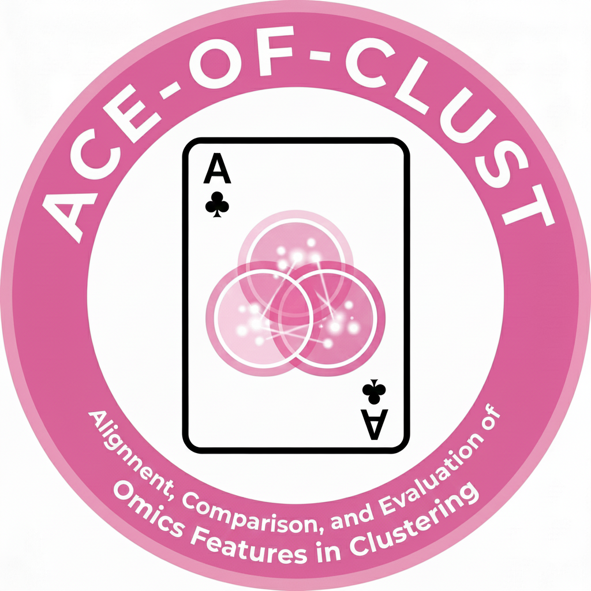

# ACE-OF-Clust

  

Welcome! This site contains tutorials and API reference for `ace_of_clust`.

- Start with the **Quickstart** or **Toy Example** tutorial.
- See **Reference** for function/class docs.

## Tutorials

- [Quickstart](tutorials/quickstart/)
- [Toy Example](tutorials/toy_example/)
- [Run Clumppling](tutorials/run_clumppling.md)
- [PBMC3K Hard Clustering Example](tutorials/ex1_pbmc3k_hc/)
- [HBC Spatial Transcriptomics Mixed-Membership Clustering Example](tutorials/ex2_hbc_mmc/)
